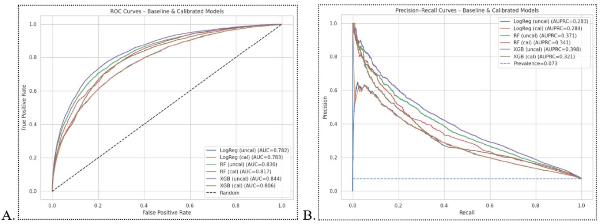
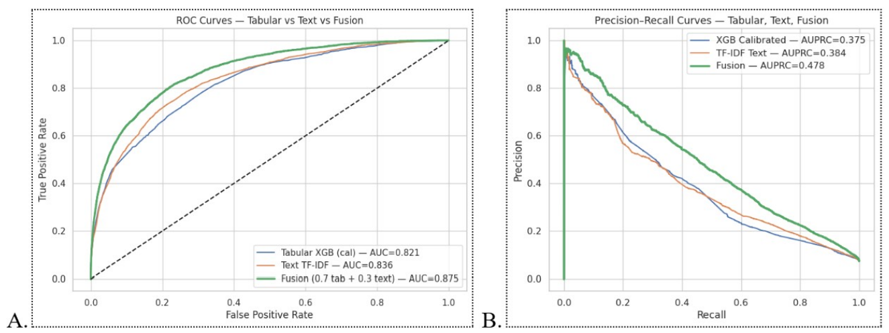
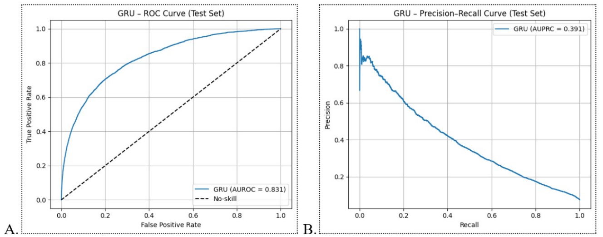

# ED Triage ICU Risk Prediction (MIMIC-IV ED) — Calibrated Multimodal + GRU

This repository contains a Google Colab–ready pipeline that builds an Emergency Department (ED) triage cohort from **MIMIC-IV v3.1** and **MIMIC-IV ED** (PhysioNet), trains predictive models for **ICU admission within 24 hours**, and evaluates both **discrimination** and **calibration** for deployment-oriented risk scoring.

> **Note:** This repo does **not** include any extracted MIMIC data files. Users must have credentialed PhysioNet access and run the BigQuery extraction to reproduce results.

---

## Project Overview

**Goal:** Predict whether an ED encounter will result in **ICU admission within 24 hours** using information available at or shortly after triage.

**Modalities:**
- **Structured:** demographics + early vital signs (aggregated within first 2 hours)
- **Text:** chief complaint (TF-IDF baseline)
- **Temporal:** first-hour vital sign sequences (GRU)

**Deployment emphasis:**
- explicit **probability calibration** (reliability, not AUROC-only)

---

## Dataset

- **Source:** MIMIC-IV v3.1 + MIMIC-IV ED (PhysioNet)
- **Institution:** Beth Israel Deaconess Medical Center (BIDMC)
- **Time range:** 2008–2019
- **Outcome:** ICU admission within 24 hours of ED arrival
- **Cohort size:** 299,398 ED encounters  
- **Positive class:** 7.39% (ICU within 24h)

Governance requires credentialed PhysioNet access and compliance with the Data Use Agreement (DUA).

---

## Repository Structure

```
ed-triage-icu24h/
├── ed_triage_pipeline.ipynb # Main Google Colab notebook (end-to-end pipeline)
├── README.md # Project overview + instructions
├── requirements.txt # Python dependencies
├── LICENSE # MIT License
├── .gitignore # Ignores data extracts, secrets, and outputs
├── sql/
│   └── ed_triage_cohort.sql # BigQuery cohort extraction query (MIMIC-IV ED)
├── figures/
│   ├── figure1_class_distribution.png # ICU-within-24h class imbalance
│   ├── figure2_baseline_roc_pr.png # Baseline structured model ROC/PR curves
│   ├── figure3_calibration_uncal_vs_cal.png # Calibration curves (uncalibrated vs calibrated)
│   ├── figure4_fusion_roc_pr.png # Fusion ROC/PR (XGB + TF-IDF)
│   ├── figure5_gru_roc_pr.png # GRU temporal model ROC/PR curves
│   └── figure6_shap_summary.png # SHAP summary plot (XGBoost interpretability)
└── results/
    ├── calibration_results.csv # Tables 3–5 merged: calibration (ECE/Brier)
    └── model_performance_heldout_test.csv # Table 6: held-out test AUROC/AUPRC + notes
```


---

## Methods Summary

### Baseline Structured Models
- Logistic Regression (interpretable baseline)
- Random Forest (nonlinear baseline)
- XGBoost (strong tabular performance)

### Calibration
- Isotonic Regression
- Platt Scaling
- Validation-only fitting to avoid leakage

### Explainability
- Feature importance
- SHAP summary plots (global attribution)

### NLP (Chief Complaint)
- Text cleaning
- TF-IDF vectorization
- Linear classifier (LogReg / Linear SVM baseline)

### Multimodal Fusion
- Probability-level fusion combining calibrated XGBoost + TF-IDF model

### Temporal Model (GRU)
- First-hour vital sequences
- GRU sequence classifier for ICU-within-24h risk

---

## Results Snapshot

Below are key outputs from the calibrated multimodal pipeline.

### Calibration (XGBoost)


### Multimodal Fusion (XGBoost + TF-IDF)


### Temporal Model (GRU)


---

## How to Run (Google Colab)

1. Open `ed_triage_pipeline.ipynb` in Google Colab.
2. Authenticate and set your BigQuery project:
   - The project must be **your** GCP project (not `physionet-data`).
3. Run the cohort extraction query (see `sql/ed_triage_cohort.sql`).
4. Run preprocessing:
   - median imputation (numeric)
   - one-hot encoding (categorical)
   - race grouping for subgroup evaluation
5. Train models + evaluate metrics:
   - AUROC, AUPRC
   - ECE, Brier score
   - ROC/PR curves
   - reliability diagrams
6. (Optional) Export figures to `figures/` and summary tables to `results/`.

---

## Reproducibility Notes

- Extracted MIMIC-derived CSVs are intentionally excluded from the repository.
- If you choose to store extracted data locally, add it under `data/` which is gitignored by default.

---

## Outputs You Should Expect

- Cohort size confirmation and label prevalence
- Model performance table (AUROC/AUPRC)
- Calibration table (ECE/Brier)
- ROC and PR curves for:
  - structured vs fused multimodal
  - GRU temporal model
- Calibration curves showing uncalibrated vs calibrated probabilities

---

## References
- Chen, T., & Guestrin, C. (2016). XGBoost: A scalable tree boosting system.
- Cho, K., et al. (2014). Learning phrase representations using RNN encoder–decoder.

(Full reference list maintained in the associated paper/thesis document.)

---

## License
MIT License — see `LICENSE`.

---

## Author
Olaoluwa Malachi  
olaoluwa.malachi@unb.ca
